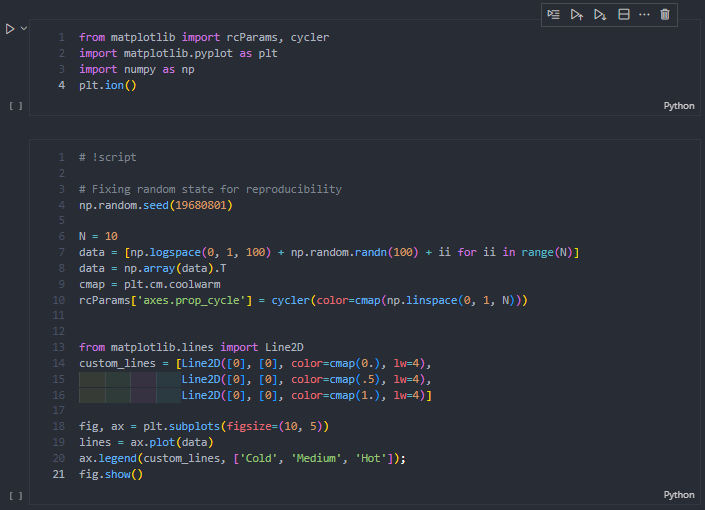

# **jupyter-to-script**

Model training is often much easier using Python scripts due to the use of remote and virtual machines and better compatibility with multi-threaded libraries. Also, Python scripts are much more convenient when automating multiple runs or tuning hyperparameters.

The existing solution using the nbconvert tool is sometimes insufficient due to its simplicity.
This repository contains an updated conversion with easy to use commands.

# Usage

Some Python libraries, especially multi-threaded ones, require a Python bolerplate to function properly. The script inserts the required line and adds indentation for the rest of the code and also removes unnecessary comments and white spaces created by nbconvert.

To indicate where the script should start, simply add the following comment to the Jupyter notebook before the training code.
This determines where to place the **"if \_\_name\_\_ == '\_\_main\_\_':"**.
```
# !script
```

The script requires only one parameter - the notebook file name. It is also possible to provide the indentation size by specifying a second argument.
```
$ convert.sh notebook.ipynb 4
```

# Example

Jupyter Notebook:

<p align="center">
    
</p>

Python script:

<p align="center">
    
</p>

[Source code](https://jupyterbook.org/en/stable/file-types/notebooks.html) comes from the official Jupyterbook website.
